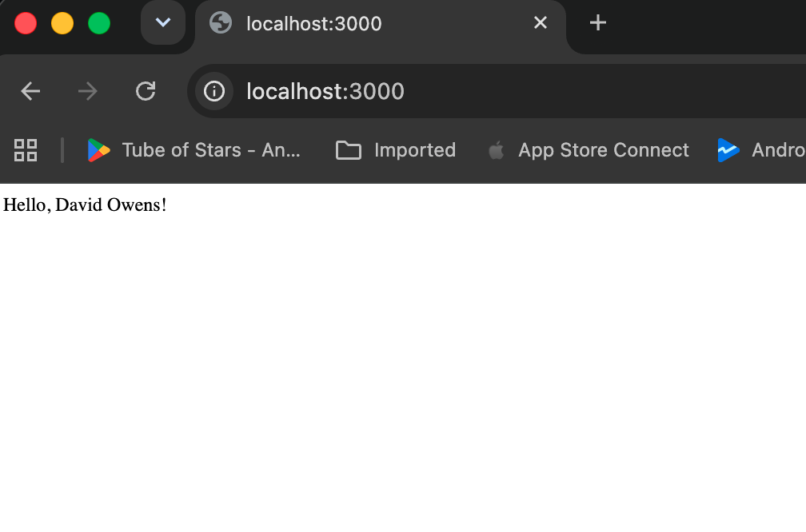
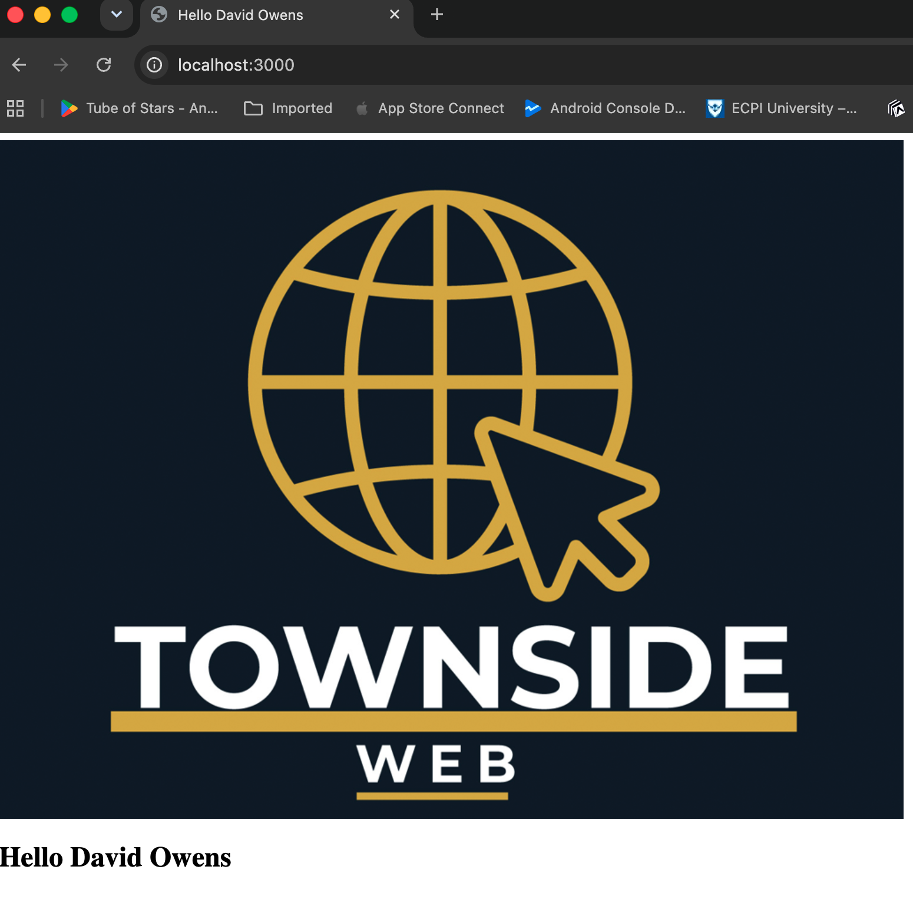

# 1.4 Guided Practice - MVC Application Structure

This project is a Node and Express application built using the MVC architecture. It includes environment configuration, EJS views, static image support, and session tracking.

## Initial Application

## Final Application

