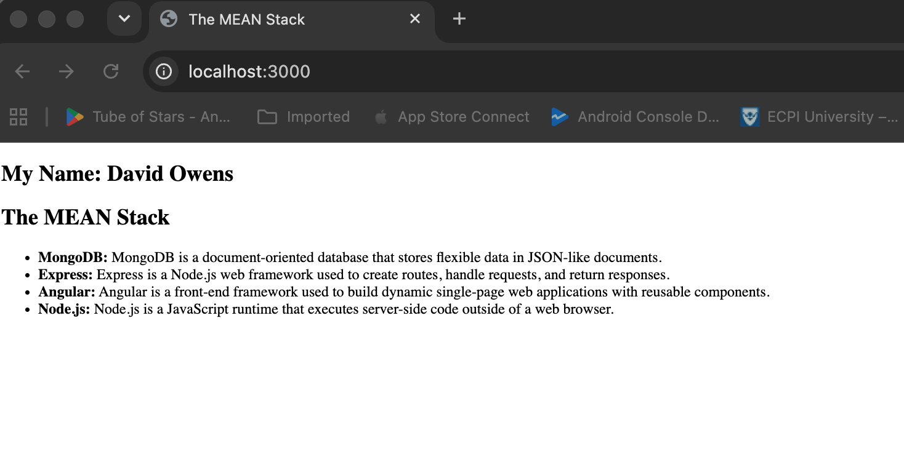

# 1.5 Performance Assessment - The MEAN Stack

This project is a Node and Express application built using the MVC architecture. It displays my name and definitions for the four technologies that make up the MEAN stack.

## Application Screenshot

