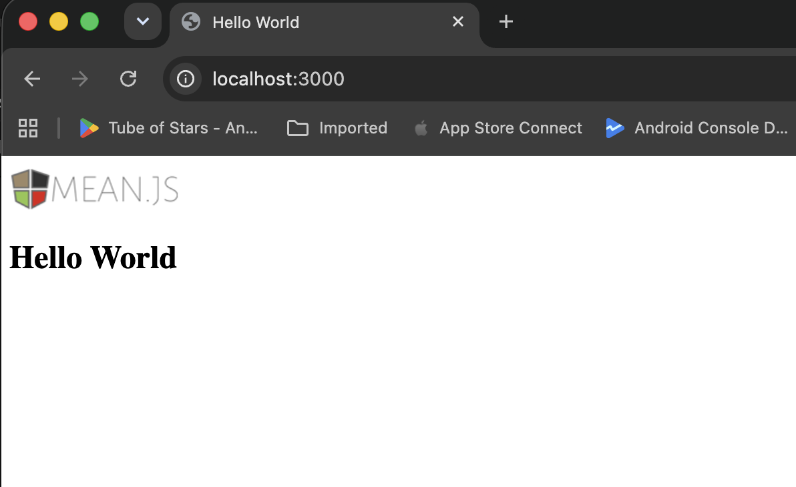
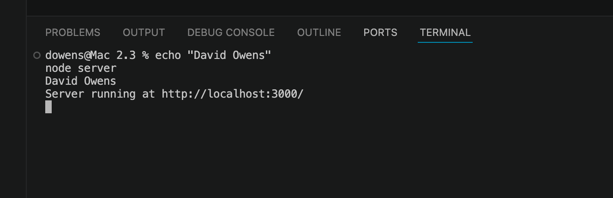
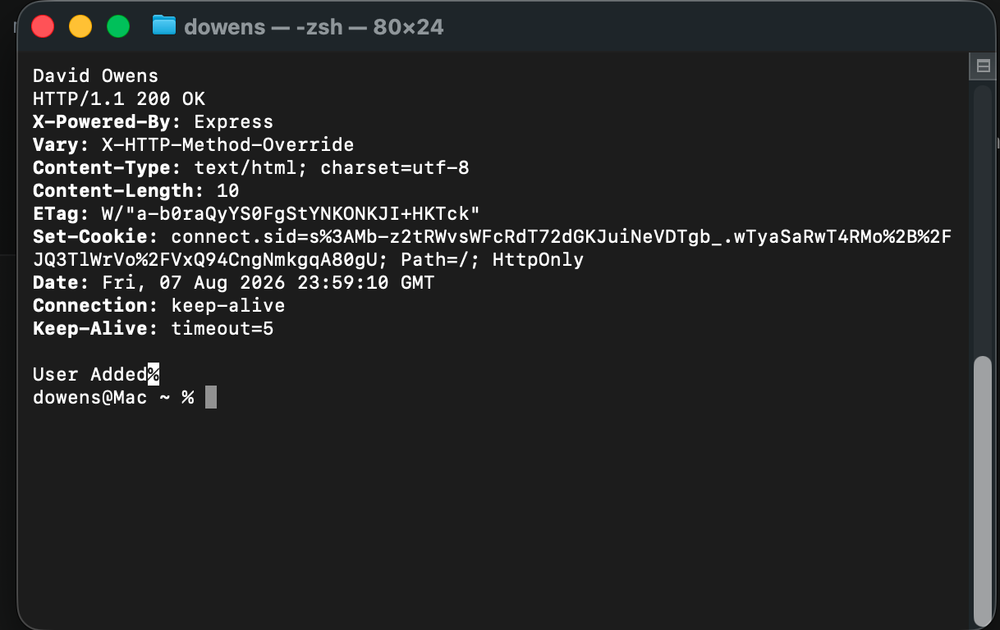
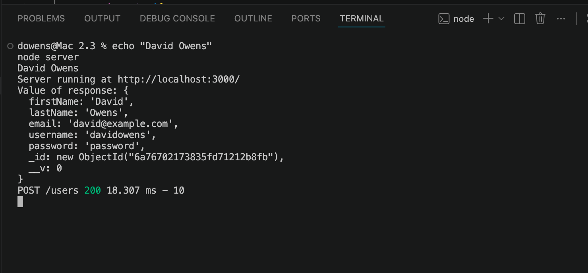

# 2.3 Guided Practice - Mongoose Integration

This project demonstrates integrating Mongoose and MongoDB into an MVC MEAN stack application.

## Starter Application

## Mongoose Server

## User Added - Terminal

## User Added - VS Code

