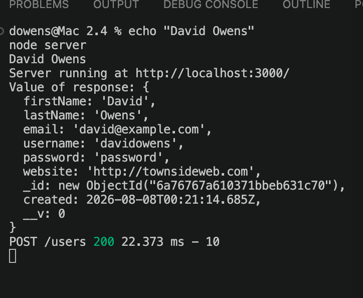
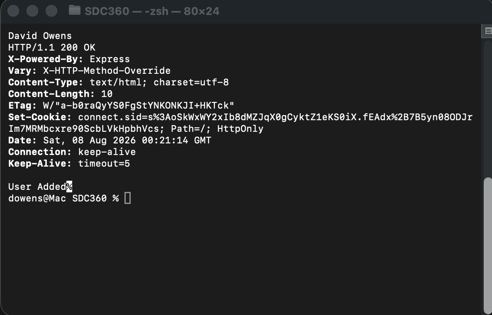

# 2.4 Performance Assessment - Extending Mongoose Schema

This project extends the Mongoose User schema from the guided practice by adding a default created date and schema modifiers for username and website values.

## User Added - VS Code

## User Added - Terminal

